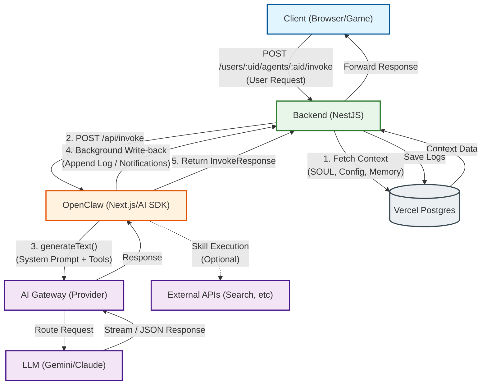
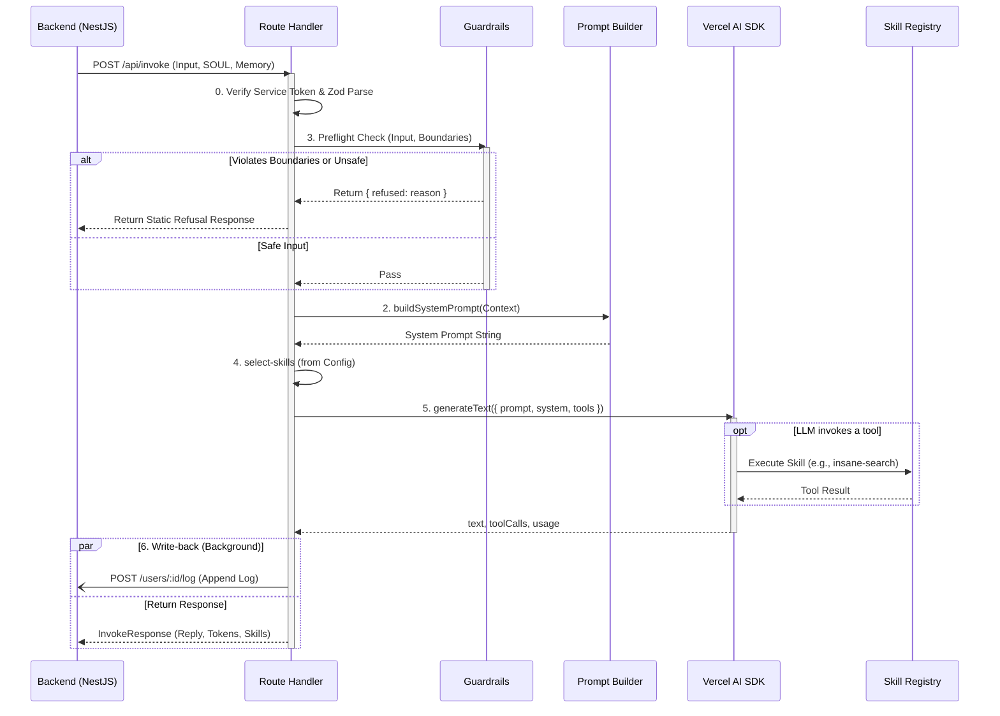

# OpenClaw Architecture & Workflow

이 문서는 OpenClaw의 전체 시스템 구조와 핵심 기능인 `Invoke` 프로세스의 실행 흐름(Workflow)을 다룹니다.

## 1. System Architecture (구조도)

OpenClaw는 모노레포(`AIM/openclaw`) 내에 위치하며, Vercel에 독립적인 서버리스(Next.js App Router) 애플리케이션으로 배포됩니다. 백엔드(NestJS)가 상태와 도메인 로직을 관리하고, OpenClaw는 순수하게 LLM 런타임 환경을 제공하는 **무상태(Stateless) 프록시** 역할을 합니다.

---

## 2. Invoke Workflow (실행 흐름도)

`POST /api/invoke` 엔드포인트가 호출되었을 때 내부적으로 실행되는 6단계 런타임 파이프라인입니다.

### 파이프라인 단계 설명

1. **0. 진입 및 검증**: 서비스 토큰(`BACKEND_SERVICE_TOKEN`)을 검증하고, 요청 데이터를 Zod 스키마로 검사합니다.
2. **1. Load Agent**: OpenClaw는 별도로 DB를 조회하지 않습니다. 백엔드가 넘겨준 SOUL과 Memory를 그대로 신뢰하고 사용합니다.
3. **2. Build System Prompt**: SOUL(Identity, Personality, Rules)과 User Memory를 조합하여 일관된 마크다운 기반의 시스템 프롬프트를 직렬화합니다.
4. **3. Guardrails (Pre-LLM)**: LLM을 호출하기 전에 입력이 안전한지, SOUL의 `boundaries`를 침해하지 않는지 검사합니다. 침해 시 비용 발생 없이 즉시 거절 응답을 반환합니다.
5. **4. Select Skills**: 에이전트의 `config.md`에 활성화된 도구들만 레지스트리에서 필터링하여 AI SDK의 `tools` 객체로 매핑합니다.
6. **5. Run (LLM 호출)**: Vercel AI SDK를 통해 모델(Gemini 2.5 Pro 등)을 호출합니다. 에이전트가 필요하다고 판단하면 중간에 Skill을 실행하고 결과를 LLM에 다시 주입합니다.
7. **6. Write-back & Response**: 생성된 응답을 백엔드로 즉시 반환하는 동시에, 백엔드의 대화 기록(`POST /users/:id/log`)이나 알림(`POST /users/:id/notifications`) 엔드포인트를 비동기 백그라운드 작업으로 호출하여 상태를 동기화합니다.
